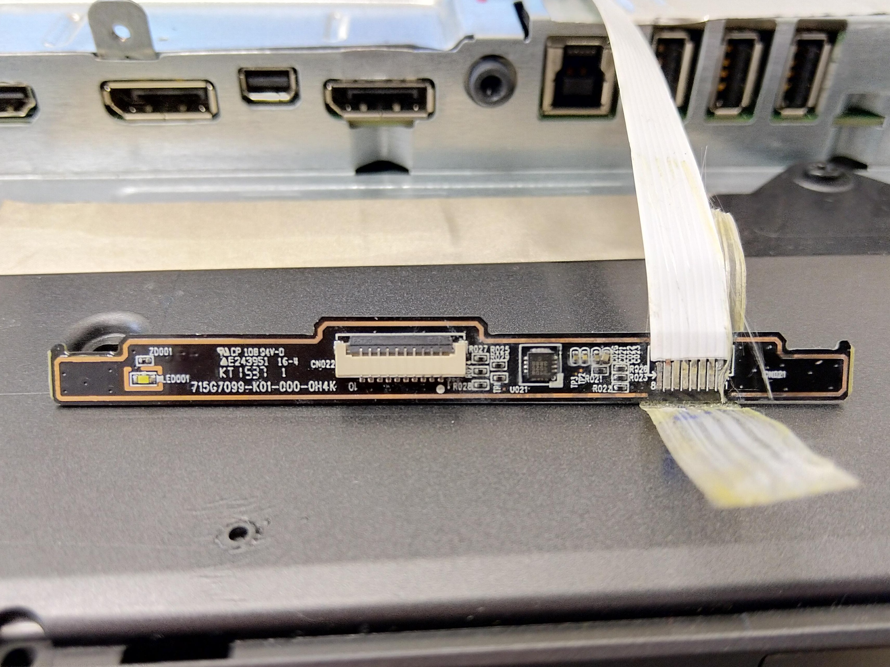
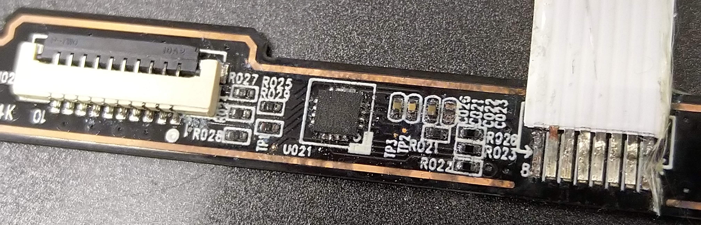

= Alternative sensor controller board for Dell UltraSharp U2515H

Replacing original sensor controller board with a custom one.

== Sensor controller board

Model: 715G7099-K01-000-0H4K

There is one 8-wire FFC cable connecting our controller board to the display main board.
The other flexible cable is actually 10-pin FPC with capacitive sensors (5 sensors, two wires per sensor).

[cols=3]
|===
| Controller board pin
| Main board pin
| Function

| 1
| 8
| I2C SDA

| 2
| 7
| I2C SCL

| 3
| 6
| ~HI/BUZ

| 4
| 5
| LED on

| 5
| 4
| ??? (0 V on scope)

| 6
| 3
| Vss

| 7
| 2
| Vdd

| 8
| 1
| NC
|===

All signals are 3.3 V.

Controller IC is Cypress Semiconductor CY8CMBR3108.

According to the IC datasheet, default I2C address is 0x37.
